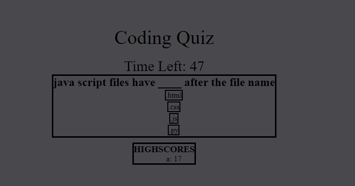

# coding_quiz
A coding quiz created for UConn Coding Boot Camp Challenge_4

## Preview

The application is a 5 question quiz with a timer that acts as your score
If you get a question wrong the timer/score is reduced by 10
at the end it will ask you to submit a name to display in the highscores
you can retry as many times as you want

Repo Link: https://github.com/NeelCheo/coding_quiz
Website Link: https://neelcheo.github.io/coding_quiz/
